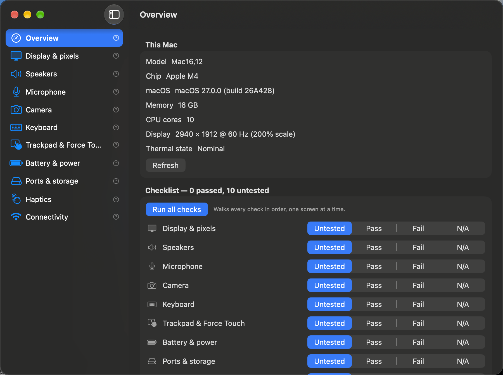

# Checkup

A Mac app for checking a MacBook's hardware by hand: screen, speakers,
microphone, camera, keyboard, trackpad, battery, storage, haptics, network. Each
screen runs a live test and records a pass/fail result, and the whole checklist
exports as a Markdown report.

Built with the Swift compiler and macOS SDK that are already installed. No Xcode
project, no package manager, no dependencies, no network service.



## Checks

| Screen | What it does |
| --- | --- |
| Overview | Machine summary, the checklist, a guided pass, and report export |
| Display & pixels | Full-screen window cycling red, green, blue, cyan, magenta, yellow, white, 50% grey, black. Finds dead and stuck pixels, backlight bleed, banding. Click or any key advances, Escape stops |
| Speakers | Left / right / both tones, a 20 Hz to 20 kHz sweep, white noise, volume slider |
| Microphone | Records a short clip with a live level meter and peak hold, then plays it back |
| Camera | Live preview, capture-device list, active resolution |
| Keyboard | On-screen ANSI layout that lights up each key as you press it, with a list of keys not yet pressed |
| Trackpad & Force Touch | Drag path, click detection, force pressure, pinch/rotate/swipe, multi-finger touches |
| Battery & power | Cycle count, health against design capacity, charge and power state from the AppleSmartBattery IORegistry node |
| Ports & storage | Mounted volumes plus a 64 MB write/read speed test, verified on read-back and deleted afterwards |
| Haptics | The three NSHapticFeedbackManager patterns, singly and in a burst |
| Connectivity | Network interfaces and their IPv4/IPv6 addresses |

Each check has a Pass / Fail / Untested / N/A picker and a notes box. Results are
saved and survive quitting. Copy report puts the Markdown on the clipboard, Save
report writes it to a file.

Run all checks on the Overview walks the eleven screens in order with a step
counter.

## Build

```sh
make check     # typecheck, lint the plist, assert the usage strings
make test      # 58 logic checks
make build     # compile and ad-hoc sign .build/Checkup.app
make install   # copy to ~/Applications and register it
make dmg       # .build/Checkup-1.0.dmg
make icon      # redraw the app icon
```

Install to ~/Applications rather than running from .build, so a stable path
holds the microphone and camera permission grants.

For a script or CI:

```sh
.build/Checkup.app/Contents/MacOS/Checkup --list-checks
```

prints the report for this machine and exits.

The icon and the installer background are drawn in code by `scripts/`, so they
can be edited and re-rendered instead of being hand-exported files. The icon
generator samples its own output and fails if a pixel is not where the drawing
says it should be.

## Windows

`windows/` holds the same checklist as an Electron app, packaged as an NSIS
installer, `Checkup-Setup-1.0.0.exe`. See [windows/README.md](windows/README.md)
for how to build it and for what has and has not been verified. It has not been
run on Windows.

## Limits

- The signature is ad-hoc, so the app is for this Mac. Other Macs need
  right-click then Open on first launch; public distribution would need a
  Developer ID signature and notarisation.
- The app cannot see or hear. Dead pixels, speaker rattle, microphone clarity
  and haptic feel are yours to judge; each screen says what to look for.
- Battery temperature is blank on Apple Silicon, where that key is not in the
  AppleSmartBattery node.
- The storage test measures the volume holding the temporary directory, not a
  removable one.
